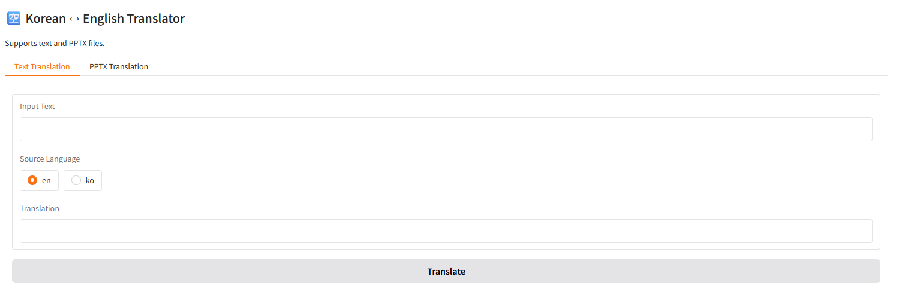

# 📝 PPT-Translate / 파워포인트 번역

[](LICENSE)
[](https://www.python.org/)
[](https://fastapi.tiangolo.com/)
[](https://huggingface.co/docs/transformers)
[](https://gradio.app/)
[](https://github.com/QuantumNovice/ppt-translate/actions)
[](https://github.com/QuantumNovice/ppt-translate/stargazers)

[](https://github.com/QuantumNovice/ppt-translate/issues)
[](https://github.com/QuantumNovice/ppt-translate/pulls)
[](https://github.com/QuantumNovice/ppt-translate/graphs/contributors)
[](https://github.com/QuantumNovice/ppt-translate/commits/main)
[](https://github.com/QuantumNovice/ppt-translate)
[](https://github.com/QuantumNovice/ppt-translate)
[](https://hits.sh/github.com/QuantumNovice/ppt-translate/)

A selfhosted translation API accessible via many languages for batch translation of powerpoint presentation files and plain .text

PowerPoint 프레젠테이션 파일과 일반 텍스트의 일괄 번역을 위해 여러 언어로 접근 가능한 셀프호스팅 번역 API

## 🌐 Overview

Translate PowerPoint presentations or plain text between **Korean ↔ English** using local translation models.  
Built on FastAPI and Hugging Face Transformers, with an optional Gradio UI.

## Overview-Korean

로컬 번역 모델을 사용하여 **한국어 ↔ 영어** 간 PowerPoint 프레젠테이션이나 일반 텍스트를 번역하세요.
FastAPI와 Hugging Face Transformers를 기반으로 구축되었으며, Gradio UI(선택 사항)도 제공됩니다.

---

## UI Screenshot



## 🚀 Quick Start

```bash
git clone https://github.com/QuantumNovice/ppt-translate.git
cd ppt-translate
pip install -r requirements.txt
uvicorn app:app --reload
```

Then open your browser at:  
👉 http://127.0.0.1:8000/docs

For the Gradio UI:

```bash
python app.py
```

---

## 🧩 API Endpoints

| Method | Endpoint               | Description                               |
| ------ | ---------------------- | ----------------------------------------- |
| `POST` | `/translate`           | Translate text between Korean and English |
| `POST` | `/ppt`                 | Upload a `.pptx` for translation          |
| `GET`  | `/download/{filename}` | Download the translated file              |

---

## 💡 Example Requests

### Python

```python
import requests
r = requests.post("http://127.0.0.1:8000/translate",
                  json={"text": "안녕하세요", "src_lang": "ko"})
print(r.json())
```

### JavaScript (Node)

```js
import fetch from "node-fetch";

const res = await fetch("http://127.0.0.1:8000/translate", {
  method: "POST",
  headers: { "Content-Type": "application/json" },
  body: JSON.stringify({ text: "Hello world", src_lang: "en" }),
});
console.log(await res.json());
```

### cURL

```bash
curl -X POST "http://127.0.0.1:8000/translate"   -H "Content-Type: application/json"   -d '{"text": "안녕하세요", "src_lang": "ko"}'
```

### C#

```C#
using System;
using System.Net.Http;
using System.Text;
using System.Threading.Tasks;

class Program {
    static async Task Main() {
        using var client = new HttpClient();
        var content = new StringContent("{\"text\": \"안녕하세요\", \"src_lang\": \"ko\"}", Encoding.UTF8, "application/json");
        var response = await client.PostAsync("http://127.0.0.1:8000/translate", content);
        Console.WriteLine(await response.Content.ReadAsStringAsync());
    }
}

```

### Rust

```rust
use reqwest::Client;
use serde_json::json;

#[tokio::main]
async fn main() -> Result<(), reqwest::Error> {
    let client = Client::new();
    let res = client
        .post("http://127.0.0.1:8000/translate")
        .json(&json!({ "text": "안녕하세요", "src_lang": "ko" }))
        .send()
        .await?;
    println!("{}", res.text().await?);
    Ok(())
}

```

### C++ (libcurl)

```cpp
#include <curl/curl.h>
#include <iostream>

int main() {
    CURL* curl = curl_easy_init();
    if (curl) {
        curl_easy_setopt(curl, CURLOPT_URL, "http://127.0.0.1:8000/translate");
        curl_easy_setopt(curl, CURLOPT_POSTFIELDS, "{\"text\": \"안녕하세요\", \"src_lang\": \"ko\"}");
        struct curl_slist* headers = NULL;
        headers = curl_slist_append(headers, "Content-Type: application/json");
        curl_easy_setopt(curl, CURLOPT_HTTPHEADER, headers);
        curl_easy_setopt(curl, CURLOPT_WRITEFUNCTION, NULL);
        curl_easy_perform(curl);
        curl_easy_cleanup(curl);
    }
    return 0;
}

```

### C (libcurl)

```c
#include <stdio.h>
#include <curl/curl.h>

int main(void) {
    CURL *curl = curl_easy_init();
    if(curl) {
        const char *json = "{\"text\": \"안녕하세요\", \"src_lang\": \"ko\"}";
        curl_easy_setopt(curl, CURLOPT_URL, "http://127.0.0.1:8000/translate");
        curl_easy_setopt(curl, CURLOPT_POSTFIELDS, json);
        struct curl_slist *headers = NULL;
        headers = curl_slist_append(headers, "Content-Type: application/json");
        curl_easy_setopt(curl, CURLOPT_HTTPHEADER, headers);
        curl_easy_perform(curl);
        curl_easy_cleanup(curl);
    }
    return 0;
}

```

### Java

```java
import java.net.http.*;
import java.net.URI;

public class Main {
    public static void main(String[] args) throws Exception {
        var client = HttpClient.newHttpClient();
        var request = HttpRequest.newBuilder()
            .uri(URI.create("http://127.0.0.1:8000/translate"))
            .header("Content-Type", "application/json")
            .POST(HttpRequest.BodyPublishers.ofString("{\"text\":\"안녕하세요\",\"src_lang\":\"ko\"}"))
            .build();
        var response = client.send(request, HttpResponse.BodyHandlers.ofString());
        System.out.println(response.body());
    }
}
```

### go

```go
package main

import (
    "bytes"
    "fmt"
    "net/http"
    "io/ioutil"
)

func main() {
    data := []byte(`{"text":"안녕하세요","src_lang":"ko"}`)
    resp, err := http.Post("http://127.0.0.1:8000/translate", "application/json", bytes.NewBuffer(data))
    if err != nil {
        panic(err)
    }
    defer resp.Body.Close()
    body, _ := ioutil.ReadAll(resp.Body)
    fmt.Println(string(body))
}
```

---

## 🧠 Models Used

| Direction        | Model                                                              |
| ---------------- | ------------------------------------------------------------------ |
| Korean → English | `Helsinki-NLP/opus-mt-ko-en`                                       |
| English → Korean | `seongs/ke-t5-base-aihub-koen-translation-integrated-10m-en-to-ko` |

---

## 🛠 Stack

- FastAPI
- Transformers
- python-pptx
- Gradio
- Uvicorn

---

## 🧪 Development

### Run tests

```bash
pytest
```

### Run with Docker

```bash
docker build -t ppt-translate .
docker run -p 8000:8000 ppt-translate
```

---

## 📜 License

Do whatever you want with this project.
